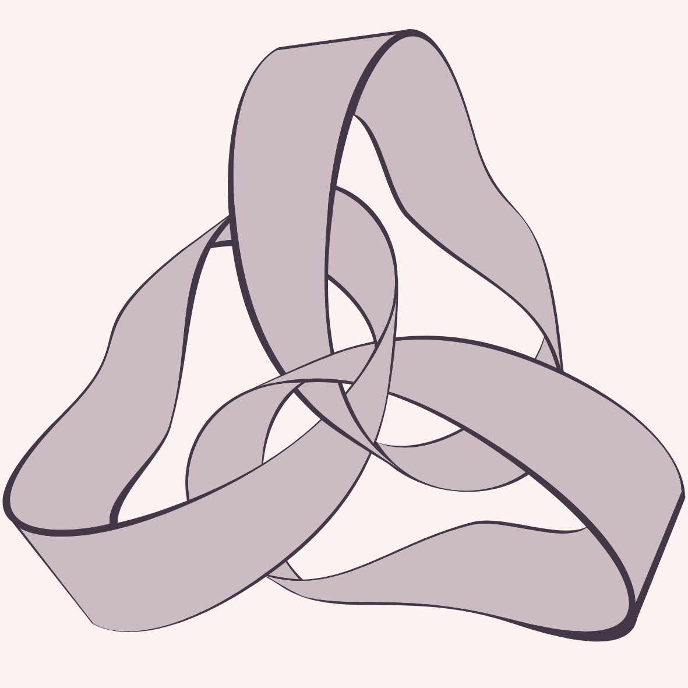
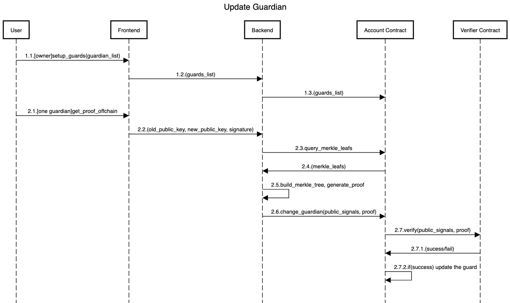
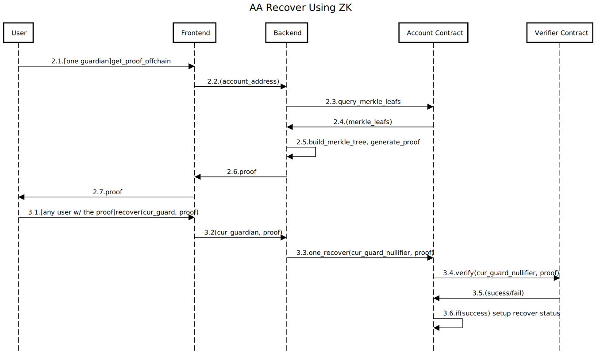

    
    <h1 align="center">
        PrivateGuardian
    </h1>
    
PrivateGuardian to create and verify zero-knowledge proofs for contract wallet guardian.

    

---

## Background

### What is social recovery

Social recovery is a smart contract wallet technique whereby a user is able to grant trusted persons the ability to transfer the ownership of contract wallet to their new account. This is useful in case the user accidentally leaks their private key of their account - ownership can simply be transferred and the user is able to again access their account exclusively.

### What is Guardian

To do this, a smart contract wallet user (Especially EIP4337 based wallet) will first nominate another Ethereum address or multi-signer scheme to be their guardian. This is done by calling a method on the user's smart contract wallet, `Wallet.addGuardian()`, and passing the Ethereum address of the guardian. This address is then placed into storage on-chain.

If the user later leaks private key of their account, they will ask the guardian to transfer their ownership. The guardian will produce a signature indicating their approval, and `Wallet.recover()` will be called. Under the hood, this transfers ownership of the smart contract wallet to a new address held by the user.

### How does zero-knowledge proof function in social recovery

The approach without zero-knowledge proof places the Ethereum address of the `guardian` in plain text on-chain. We seek to instead keep the `guardian` address private, whilst still allowing social recovery functionality.

- single address as a guardian
    
    To do this, when a user is adding a `guardian`, they instead pass the hash of the `guardian` address into adding guardian function and it is stored on-chain.
    
    Then when the guardian later comes to transfer ownership of their wallet, the guardian will generate a zk proof locally to prove that they know the preimage (the input address) to the `guardian` hash that is stored on chain. This proof is then passed to recover function, instead of passing a signature as in standard social recovery.
    
    The proof is validated on chain by a proof validator contract, and if successful, the usual recovery process occurs - giving the user access to their account again.
    
- multiple address as guardians
    
    To prevent single point of failure, the user is adding a list of members as guardians and when   number of members approving recovery passes certain threshold, the recovery process can be triggered. The only two states stored on-chain are merkle root which identifies the uniqueness of guardian addresses, as well as the approval threshold. 
    
    The proof system contains two parts:
    
    - The updating of guardian members
        
        Every member generates a pair of private key and public key then public keys are kept as leaf nodes of the merkle tree. Any member is allowed to update their public key. The process first requires proof of membership in the current merkle tree and then a valid update of the public key leaf node in question.
        
    - The recovery process
        
        When it comes to transferring the ownership of wallet by the guardians, the guardians will generate a zk proof locally to prove that they sign the preimage (the new owner address) with the public keys aligning with the merkle root that is stored on chain. This proof is then passed to recover function `Wallet.recover()`.
        
        The proof is validated on chain by a proof validator contract, and if successful, the valid request of transferring ownership from this guardian would update the total approval by adding one. Finally, if total approval passes the threshold, then usual recovery process occurs - transfer ownership of the wallet to the new owner address.
        

To demonstrate this functionality,  we have implemented a basic proof of concept project **PrivateGuardian** by making use of a `groth16` zkSNARK via the `circom` tooling.  In **PrivateGuardian**, we choose the scheme of “multiple address as guardians”.

## Solution of PrivateGuardian

### Circuit Design

#### 1. **Circuit: Guardian updating publicKey for itself**

Suppose you (as a guardian for a wallet) has registered your public key on-chain, and you want to prove that the private key paired with public key updated is owned by you, without requiring you send a transaction on-chain which potentially exposes the relation between an ethereum address and a public key. Furthermore, signature verification can be executed off-chain which is a large reduction of gas consumption on-chain. We can mathematically describe the function as follows:

- The private input ($w$)
    - siblings of merkle proof
    - signature of new public key signed by old private key: $sign(newPubKey, oldPrivKey)$
- The public input ($x$)
    - old merkle root
    - old public key and its leaf node index
    - new public key
- The output
    - new merkle root
- The verification function $f(x,w)$
    - Check that old public key is leaf node of old merkle root
    - Check that signature of new public key is signed by old private key: $Verify(signature, newPubKey, oldPubKey)=Valid$
    - Updating merkle root with new public key and return it

#### 2. **Circuit: Social recovery proof by any guardian**

You (as a guardian for a wallet) can initiate or participant a social recovery process by publishing a proof on-chain that contains poseidon hash of new owner address, and a ZK-SNARK proving that (i) you own a private key paired with a public key which is stored on-chain, (ii) that the hash of new owner address is signed with the private key you own. For avoiding double-use of the same proof, you use the hash of new owner address’s hash and public key’s leaf node index  as a nullifier. Specifically, the ZK-SNARK is as follows:

- The private input ($w$)
    - poseidon hash of new owner address
    - merkle root
- The public input ($x$)
    - siblings of merkle proof
    - public key and its leaf node index
    - signature of :  $sign(hash_{newOwnerAddr}, privKey)$
- The output
    - Nullifier: $hash(hash_{newOwnerAddr}, Index_{pubKey})$
- The verification function $f(x,w)$
    - Check that signature of new owner address is signed by guardian’s private key: $Verify(signature, hash_{newOwnerAddr}, pubKey)=Valid$
    - Check that public key is leaf node of old merkle root
- Nullifier verification on-chain
    - Check nullifier is not used

### Dapp Service Design

#### 1. Service for updating guardian

#### 2. Service for social recovery

## Further Improvements

- Proof aggregation will be added that allows multiple owners to aggregate their proofs into one thereby reducing the gas cost to verify the proof onchain.
- Relayer will not only support EIP-4337, but also other kinds of multi-sign wallet.
- We plan to separate private module from guardian so that it can be integrated into any other applications.
- We plan to upgrade private module as general private multi-sign module which is not only for voting but can support any type of transactions.

## Reference

- https://github.com/thomas-waite/zkSocialRecovery
- [Design Pattern of ZkSnark](https://vitalik.ca/general/2022/06/15/using_snarks.html)